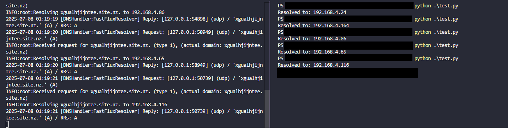

# DNS Fast-Flux+DGA Server

This project implements a custom DNS server using Python that:

- Generates pseudo-random domain names (DGA - Domain Generation Algorithm)
- Selects random IPs from a pool (Fast-Flux behavior)
- Responds to DNS A record queries for currently "active" generated domains

---

## Components

### 1. **DGA (Domain Generation Algorithm)**

- Uses a **Linear Congruential Generator (LCG)** to produce deterministic domain names based on:
  - A `seed` value
  - The current time (in hours)

```python
def gen_domain(seed, time_s):
```

- Random domains follow the format:  
  `[random-chars].[TLD].[country-TLD]`  
  Example: `fzqgiefbciwsrskb.news.it`

- Every 30 seconds, a new domain is selected from a list of 24 hourly predictions.

---

### 2. **FastFluxResolver**

```python
class FastFluxResolver:
    def resolve(self, request, handler):
```

- Implements a custom resolver using `dnslib`.
- If the incoming query matches the current active domain (`domain_in_use`) and is of type A (IPv4), it returns a random IP from the `ip_pool`.

---

### 3. **DNS Server**

- The DNS server listens on `0.0.0.0:8053`.
- Accepts and responds to incoming DNS queries using `FastFluxResolver`.

```python
dns_server = DNSServer(resolver, port=8053, address="0.0.0.0")
```

---

### 4. **DGA Thread**

- A background thread (`retrieve_domains`) runs continuously:
  - Generates 24 domains for the next 24 hours
  - Randomly selects one to become active (`domain_in_use`)
  - Updates the active domain every 30 seconds

---

### 5. **IP Pool**

- A fixed internal IP pool is defined from `192.168.4.1` to `192.168.4.253`.

---

## Testing

### Use `dig` (preferred):

```bash
dig @127.0.0.1 -p 8053 <domain> A
```

### Or use Python:

```python
resolver = dns.resolver.Resolver()
resolver.nameservers = ["127.0.0.1"]
resolver.port = 8053
resolver.resolve("fzqgiefbciwsrskb.news.it", "A")
```

---

## Shutdown

- Graceful shutdown on `KeyboardInterrupt` (`CTRL+C`):
  - Stops DNS server
  - Terminates DGA thread with a timeout

---

## Dependencies

- Python 3
- `dnslib`: for DNS server and message handling

Install with:

```bash
pip install dnslib
```

---

## Example

